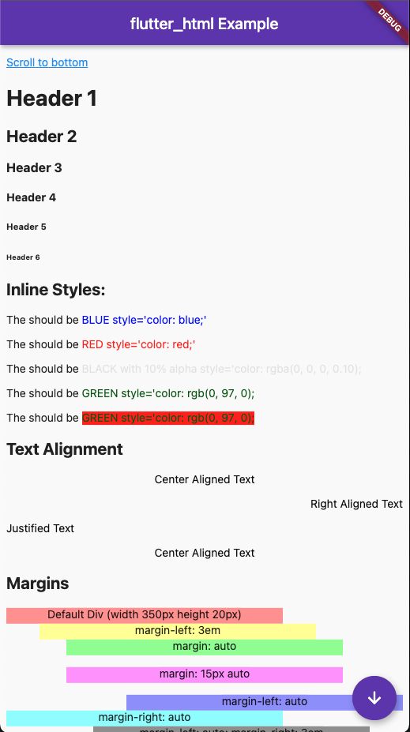

# flutter_html
[](https://pub.dev/packages/flutter_html)
[](https://codecov.io/gh/Sub6Resources/flutter_html)
[](https://circleci.com/gh/Sub6Resources/flutter_html)
[](https://github.com/Sub6Resources/flutter_html/blob/master/LICENSE)

A Flutter widget for rendering html and css as Flutter widgets.



## Installing:

Add the following to your `pubspec.yaml` file:

    dependencies:
      flutter_html: ^1.0.0-pre.1

## Currently Supported HTML Tags:
`a`, `abbr`, `acronym`, `address`, `article`, `aside`, `b`, `bdi`, `bdo`, `big`, `blockquote`, `body`, `br`, `caption`, `cite`, `code`, `data`, `dd`, `del`, `dfn`, `div`, `dl`, `dt`, `em`, `figcaption`, `figure`, `footer`, `h1`, `h2`, `h3`, `h4`, `h5`, `h6`, `header`, `hr`, `i`, `img`, `ins`, `kbd`, `li`, `main`, `mark`, `nav`, `noscript`, `ol`, `p`, `pre`, `q`, `rp`, `rt`, `ruby`, `s`, `samp`, `section`, `small`, `span`, `strike`, `strong`, `sub`, `sup`, `table`, `tbody`, `td`, `template`, `tfoot`, `th`, `thead`, `time`, `tr`, `tt`, `u`, `ul`, `var`
 
## Currently Supported CSS Attributes:
> Coming soon!
 
### Elements with planned support:

See the [development roadmap](https://github.com/Sub6Resources/flutter_html/wiki/Roadmap) for the list of elements and css attributes I plan on supporting.

## Why this package?

This package is designed with simplicity in mind. Originally created to allow basic rendering of HTML content into the Flutter widget tree,
this project has expanded to include support for basic CSS styling (both inline and in the `<style>` tag).

## Example Usage:
(For a much more extensive example, look at example/main.dart).
```dart
    Widget html = Html(
      data: """
        <div>
          <h1>Demo Page</h1>
          <p>This is a fantastic product that you should buy!</p>
          <h3>Features</h3>
          <ul>
            <li>It actually works</li>
            <li>It exists</li>
            <li>It doesn't cost much!</li>
          </ul>
          <!--You can pretty much put any html in here!-->
        </div>
      """,
      //Optional parameters:
      backgroundColor: Colors.white70,
      onLinkTap: (url) {
        // open url in a webview
      },
      style: {
        "div": Style(
          block: Block(
            margin: EdgeInsets.all(16),
            border: Border.all(width: 6),
            backgroundColor: Colors.grey,
          ),
          textStyle: TextStyle(
            color: Colors.red,
          ),
        ),
      },
      onImageTap: (src) {
        // Display the image in large form.
      },
    );
